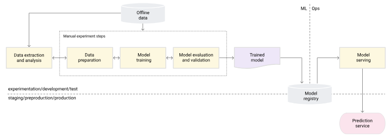
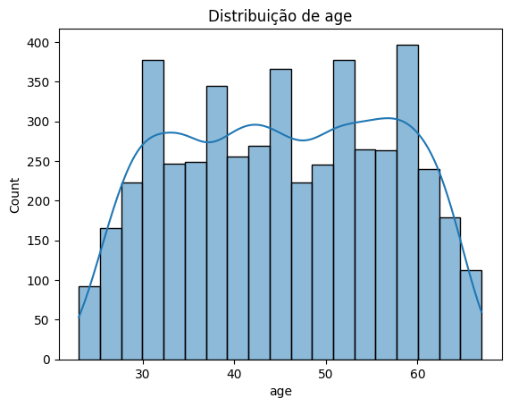
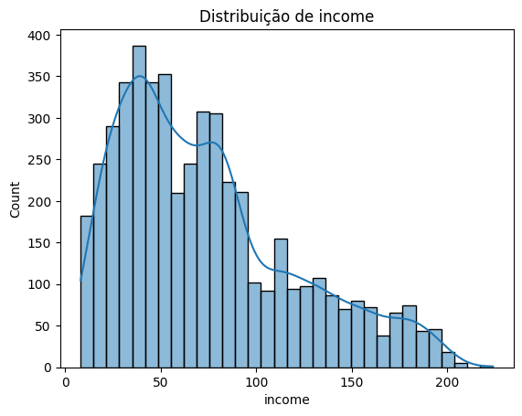
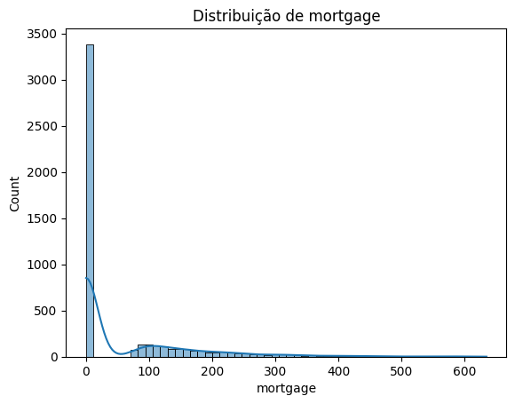
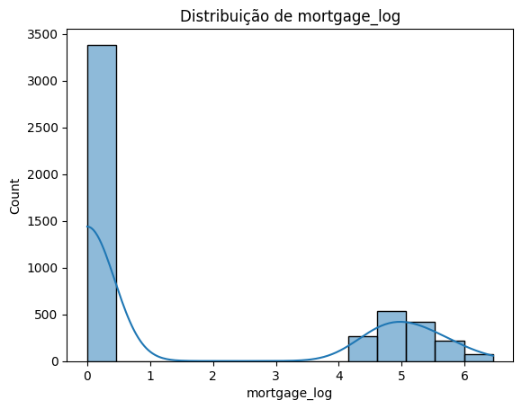

## Machine Learning I - Santander Coders 2024: Trilha de Ciência de Dados


### Sobre o Projeto

Este projeto visa desenvolver um sistema preditivo para auxiliar na avaliação de crédito. Utilizando algoritmos de Machine Learning, o projeto tem dois objetivos principais: prever o score de crédito de um cliente, em um problema de regressão, e construir um modelo de classificação para determinar a aprovação ou não de crédito para clientes específicos. Este projeto pode ajudar a tomar decisões mais rápidas e assertivas, reduzindo o risco de inadimplência e otimizando a alocação de crédito.



### O Conjunto de Dados

Os dados consistem em informações pessoais e financeiras dos clientes, detalhando características relevantes para avaliação de crédito. As principais colunas dos dados incluem:

```
<class 'pandas.core.frame.DataFrame'>
RangeIndex: 5000 entries, 0 to 4999
Data columns (total 14 columns):
 #   Column              Non-Null Count  Dtype  
---  ------              --------------  -----  
 0   ID                  5000 non-null   int64  
 1   Age                 5000 non-null   int64  
 2   Experience          5000 non-null   int64  
 3   Income              5000 non-null   int64  
 4   ZIP.Code            5000 non-null   int64  
 5   Family              5000 non-null   int64  
 6   CCAvg               5000 non-null   float64
 7   Education           5000 non-null   int64  
 8   Mortgage            5000 non-null   int64  
 9   Personal.Loan       5000 non-null   int64  
 10  Securities.Account  5000 non-null   int64  
 11  CD.Account          5000 non-null   int64  
 12  Online              5000 non-null   int64  
 13  CreditCard          5000 non-null   int64  
dtypes: float64(1), int64(13)
memory usage: 547.0 KB

```

### Problema de Negócio

O setor de crédito apresenta um risco significativo para instituições financeiras, que buscam minimizar a concessão de crédito para clientes de alto risco. O problema de negócio que este projeto pretende resolver é: como prever o score de crédito dos clientes e, com base nesse score e em outras variáveis, decidir se um cliente deve ou não receber aprovação de crédito. Uma avaliação de crédito mais precisa permite que a instituição tome decisões mais informadas e minimize o risco de inadimplência, além de melhorar a experiência dos clientes de baixo risco com um processo de aprovação mais ágil.

### Objetivos

1. **Decidir a Aprovação de Crédito**: Desenvolver um modelo de classificação que determine se um cliente deve ou não receber aprovação de crédito. Esse modelo será alimentado pelo score de crédito previsto e outras variáveis relevantes.

2. **Melhorar o Processo de Avaliação de Crédito**: Automatizar o processo de análise de crédito com base em dados históricos e algoritmos preditivos, permitindo decisões mais rápidas e embasadas para aprovação de crédito.

### Feature Engineering

Foram criadas novas features, mas no sentido de analisar dados. Não usaremos todas essas features novas para evitar a multicolinearidade. Mas criamos uma feature para categorizar idades, chamda 'age_bracket_name'.

```
Column name:age_bracket_name
Generation X    2029
Millennials     1907
Baby boomers     788
Generation Z     170
Name: count, dtype: int64
```

### Pré-processamento

##### Features Numéricas

**Analisando Outliers**

A coluna 'mortgage' se destacou na analise com z score. Vamos tratar usando transformação logaritmica, pois ajuda a estabilizar a variância e consegue deixar a distribuição um pouco mais parecida com um 'sino' quando visualizamos um histograma.

$x′=log(x+1)$

Vemos também que nessa coluna há vários individuos que não tem hipotecas (valores = 0.00).

**Sobre a multicolinearidade**

As colunas 'age' e 'experience' apresentaram multicolinearidade alta, então teremos que remover uma delas.


*Flags*
> 0: Não preocupa

> 1: Moderada com ponto de **atenção!**

> 2: Alta

```
age: VIF = 42.99 (2)
experience: VIF = 21.50 (2)
income: VIF = 3.73 (0)
family: VIF = 5.50 (1)
mortgage: VIF = 1.37 (0)
```

##### Visualizações

Idade



Renda



Hipotecas



Hipotecas pré-processada



##### Features Categóricas

As únicas features categóricas que precisamos pré-processar foram 'age_bracket_name' e 'education', nas quais utilizamos One-hot Enconder.

Os dados prontos para treinamento estão salvos em seus devidos diretórios.

### Experimentações

Nosso modelo foi treinado e registramos os experimentos no MLflow. O melhor modelo para melhor adimplência foi construido usando RandomForestClassifier e usamos alguns otimizadores para procurar os melhores parâmetros. O BayasianSearchCV encontrou bons hiperparâmetros. Tais quais n_estimators=100, max_depth=5, criterion='entropy'. Os resultados foram satisfatórios. Atingimos uma acurácia de ~73% e ainda há espaço para melhorias.

Uma outra alternativa, caso a fintech queira aumentar a base de clientes e tomar um pouco mais de risco, seria um modelo construido com XGBoost baseado em recall mais alto do que precision.

#### Sobre as Métricas

Análise das Métricas no Contexto de Aprovação de Crédito

Precision: Essa métrica avalia quantas das aprovações foram de fato corretas, ou seja, quantos dos clientes aprovados realmente eram bons pagadores. Ter uma alta precision indica que você está aprovando crédito principalmente para aqueles que provavelmente irão pagá-lo corretamente.

Impacto de alta precision: Menor risco de inadimplência, pois o sistema é mais cuidadoso em aprovar apenas aqueles que têm grande chance de pagar. Isso é ideal para minimizar perdas financeiras diretas.

Recall: Essa métrica mede a proporção de bons pagadores que foram corretamente identificados e aprovados. Um alto recall significa que você está conseguindo captar a maioria dos clientes que realmente merecem o crédito.

Impacto de alta recall: Menor chance de perder potenciais bons clientes. Pode ser útil para empresas que buscam maximizar o crescimento da base de clientes, mas que têm uma estratégia para lidar com eventuais inadimplências.

Qual Métrica Priorizar?

Instituições conservadoras e avessas a risco geralmente priorizam precision. Ao focar em aprovar apenas clientes com altas chances de pagamento, reduzem o risco de inadimplência.

Instituições com foco em crescimento e dispostas a assumir algum risco podem valorizar mais o recall, para aumentar o número de clientes e captar todos aqueles que possam ser bons pagadores.

Exemplo Prático

Se um erro de aprovação (ou seja, aprovar quem não paga) é muito custoso, a prioridade deve ser aumentar o precision.

Se a meta é crescer a base de clientes e uma perda moderada é aceitável, otimizar o recall pode ser mais adequado.

Em resumo, precision geralmente é mais importante em aprovação de crédito devido ao impacto negativo de aprovações incorretas. No entanto, recall pode ser a prioridade para estratégias focadas em crescimento com maior tolerância ao risco.

### Deploy

Para uma melhor implementação, estamos utilizando esteira CI/CD no Github Actions. A melhor combinação possível para automação de deploy para projetos de machine learning: Github Actions + Cloud Run. Essa dobradinha tornou possível o CT: continuous trainning. Agora é só melhorar o modelo e trocar no código. O deploy será feito em ~4 minutos. Isso tudo garante reprodutibilidade.

### Monitoramento

Implementamos monitoramento de métricas e análises em produção também, que pode ser encontrado na branch *preprod*, dentro do diretório *src*. 
Também podemos monitorar através do Google Monitoring, para ver os logs e erros, possíveis falhas que podem acontecer e métricas.

Autores:

[Gabriel Marques](https://github.com/marqsleal)

[Mille Amorim](https://github.com/4m0r1m)

[Mileno Epifânio](https://github.com/milenoepifanio)

[Maria Paula Andrade](https://github.com/MariaPaulaAndrade)

[Juan Vieira](https://github.com/ju4nv1e1r4)
